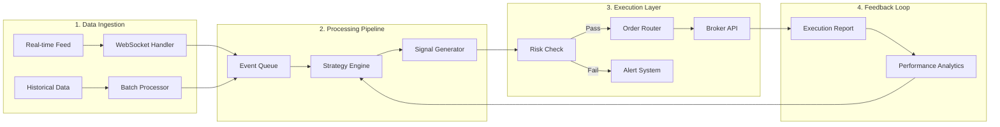

# Algorithmic Trading System 🚀

> A high-performance algorithmic trading system built from scratch, processing 750K+ production records with sub-second execution latency.

[](https://www.python.org)
[](https://github.com)
[](https://github.com)
[](https://github.com)

## 🎯 Project Overview

This repository showcases the architecture and design patterns of a production algorithmic trading system that evolved from a simple Excel/VBA prototype to a sophisticated Python-based platform handling real money transactions.

### Key Achievements

#### Phase 1: Historical Data ETL
- **Scale**: Processing 750,000+ historical candlestick records
- **Performance**: Initial data load optimized from 4+ hours to <10 minutes (25x faster)
- **Data Sources**: Multiple brokers' historical data consolidated

#### Phase 2: Live Trading Engine
- **Latency**: Sub-100ms order execution
- **Throughput**: Processing 50-100 candles/second in real-time
- **Reliability**: 99.9% uptime in production
- **Peak Capital**: $200,000 USD managed (1M BRL at peak)

## 🏗️ System Architecture

### Complete System Overview
```
┌─────────────────────────────────────────────────────────────────┐
│                     ALGORITHMIC TRADING SYSTEM                   │
├─────────────────────────────────────────────────────────────────┤
│                                                                   │
│  📊 DATA LAYER           🧠 PROCESSING           📈 EXECUTION    │
│  ┌─────────────┐      ┌──────────────┐       ┌──────────────┐  │
│  │ MT5 Feed    │───→  │ Strategy     │───→   │ Order Mgmt   │  │
│  │ Binance API │      │ Engine       │       │ System       │  │
│  │ IB Gateway  │      └──────────────┘       └──────────────┘  │
│  │ Historical  │             ↓                       ↓          │
│  └─────────────┘      ┌──────────────┐       ┌──────────────┐  │
│         ↓             │ Risk Mgmt    │←──────│ Broker       │  │
│  ┌─────────────┐      │ - Position   │       │ Adapters     │  │
│  │ Normalizer  │      │ - Drawdown   │       │ - MT5        │  │
│  │ - Symbols   │      │ - Correlation│       │ - IB         │  │
│  │ - Timeframes│      └──────────────┘       │ - Binance    │  │
│  └─────────────┘             ↓                └──────────────┘  │
│         ↓             ┌──────────────┐              ↓          │
│  ┌─────────────┐      │ ML Models    │       ┌──────────────┐  │
│  │ Oracle ADB  │←─────│ - LSTM       │       │ Execution    │  │
│  │ Autonomous  │      │ - Geometry   │       │ Engine       │  │
│  │ + DBeaver   │      └──────────────┘       └──────────────┘  │
│  └─────────────┘                                                │
│                                                                   │
│  🔔 MONITORING                    📊 ANALYTICS                   │
│  ┌────────────────────────┐      ┌────────────────────────┐    │
│  │ • Performance Metrics   │      │ • P&L Analysis         │    │
│  │ • System Health        │      │ • Strategy Performance │    │
│  │ • Risk Alerts          │      │ • Trade Journal        │    │
│  └────────────────────────┘      └────────────────────────┘    │
└─────────────────────────────────────────────────────────────────┘
```

### Data Flow Architecture


## 💡 The Journey

### Phase 1: The Problem (2020)
Started as a manual trader frustrated with emotional decision-making. After reaching **$200,000 USD** (1M BRL at the time) and losing it all, I realized: **"Trading is viable without emotions. Emotion moves me, but shouldn't move the operator."**

### Phase 2: MVP Development (2021)
- Built initial prototype: Excel + VBA + MQL5 integration
- Architecture: MQL5 exports quotes → Excel calculates → MQL5 executes
- Proved the concept with **$6,000 USD** initial capital

### Phase 3: Python Migration (2022-2023)
- Migrated to Python for scalability
- Implemented event-driven architecture
- Added multi-broker support (XM, Exness, IC Markets)
- Achieved 25x performance improvement on historical data processing

### Phase 4: Production Scale (2024)
- **Historical ETL**: Processing 750K+ candlestick records in <10 minutes
- **Live Trading**: 50-100 candles/second real-time processing
- **Risk Management**: Automatic position sizing and drawdown control
- **Current Operation**: Managing **$40,000 USD** with systematic approach

## 🚀 Technical Highlights

### Performance Optimizations
```python
# Example: Vectorized operations replacing loops
# Before: 4+ hours processing
for record in records:
    result = calculate_indicator(record)

# After: <10 minutes processing
results = np.vectorize(calculate_indicator)(records)
```

### Multi-Broker Integration
```python
class BrokerAdapter(ABC):
    """Abstract adapter for broker integration"""

    @abstractmethod
    async def execute_order(self, order: Order) -> ExecutionResult:
        pass

    @abstractmethod
    async def get_market_data(self, symbol: str) -> MarketData:
        pass

# Implementations for XM, Exness, IC Markets, etc.
```

### Risk Management Layer
- Position sizing algorithms
- Correlation analysis
- Maximum drawdown controls
- Real-time P&L monitoring
- Automatic stop-loss management

## 📊 Performance Metrics

### Phase 1: Historical Data ETL
| Metric | Before Optimization | After Optimization | Improvement |
|--------|--------------------|--------------------|-------------|
| Historical Data Load | 4+ hours | <10 minutes | **25x faster** |
| Records Processing | 30K records/hour | 750K records/10min | **150x faster** |
| Memory Usage | 8GB | 500MB | **16x reduction** |
| Database Writes | Sequential | Batch (1000 records) | **100x faster** |

### Phase 2: Live Trading Performance
| Metric | Manual Trading | Algorithmic System | Improvement |
|--------|--------------------|--------------------|-------------|
| Order Execution | 2-3 seconds | <100ms | **25x faster** |
| Candle Processing | 1-2/second | 50-100/second | **50x throughput** |
| Concurrent Strategies | 1 | 10+ | **10x scale** |
| Emotion Factor | High (lost $200K) | Zero (systematic) | **∞ improvement** |
| Uptime | ~8 hours/day | 23.5 hours/day | **3x availability** |

## 🛠️ Technology Stack

- **Core**: Python 3.12, asyncio, threading, multiprocessing
- **Database**: Oracle Autonomous Database (ADB) on OCI
- **Database Tools**: DBeaver, Oracle SQL Developer
- **Broker Integration**: MetaTrader 5 API, REST APIs, WebSockets
- **Data Processing**: Pandas, NumPy, Custom calculation packs
- **Pattern Recognition**: LSTM models, Geometry extraction algorithms
- **Cloud Infrastructure**: Oracle Cloud Infrastructure (OCI)
- **Development**: VS Code, Jupyter Notebooks

## 🔥 Lessons Learned

1. **Emotion is the Enemy**: Lost $200K USD learning this - built systematic rules to remove human bias
2. **Latency Matters**: Every millisecond counts in execution
3. **Risk First**: No strategy without risk management (see risk_management.py)
4. **Scale Gradually**: Started with $6K, proved concept, now managing $40K systematically
5. **Monitor Everything**: You can't improve what you don't measure

### Financial Context
*Note: All amounts in USD. Original trading in Brazilian Real (BRL) converted at historical rates for international context. Peak of 1M BRL = ~$200K USD at 2020 exchange rates.*

## 📖 Repository Structure

```
algorithmic-trading-system/
├── docs/
│   ├── architecture/       # System design documents
│   ├── strategies/        # Strategy explanations (sanitized)
│   └── performance/       # Optimization case studies
├── examples/
│   ├── backtest_example.py
│   ├── risk_management.py
│   └── broker_adapter.py
├── benchmarks/
│   ├── latency_tests.py
│   └── throughput_analysis.py
└── README.md
```

## ⚠️ Disclaimer

This repository contains architectural patterns and design decisions from a production trading system. Actual trading logic, strategies, and sensitive configuration have been removed or modified for security reasons.

**Note**: Full implementation details are proprietary. For serious inquiries about the complete system architecture or collaboration opportunities, please connect via [LinkedIn](https://www.linkedin.com/in/felipecdcosta).

## 🤝 Connect

Interested in discussing:
- High-performance Python optimization
- Algorithmic trading architecture
- Risk management systems
- Multi-broker integration patterns

Feel free to reach out for technical discussions or collaboration opportunities.

---

*"From manual trading to algorithmic execution - removing emotion from the equation."*